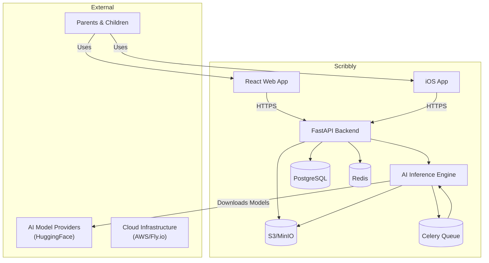
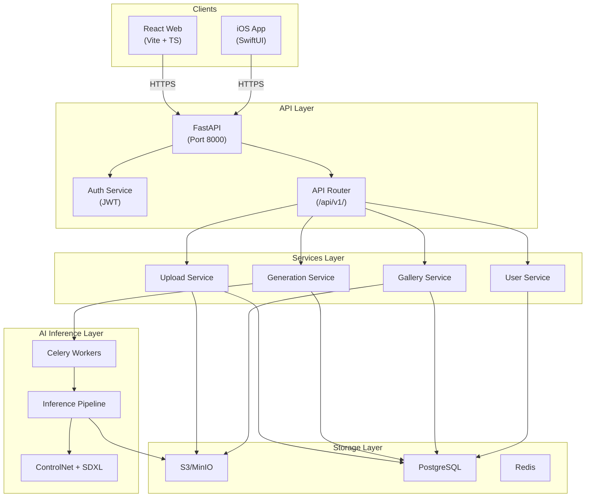
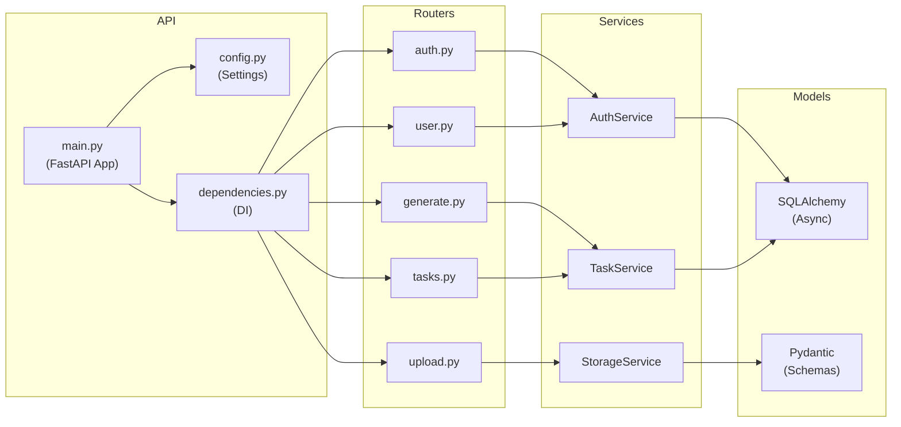
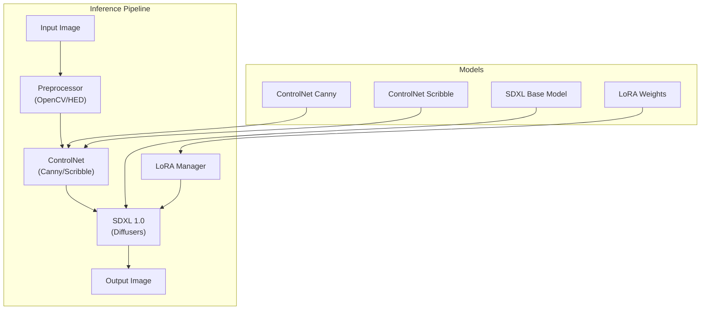
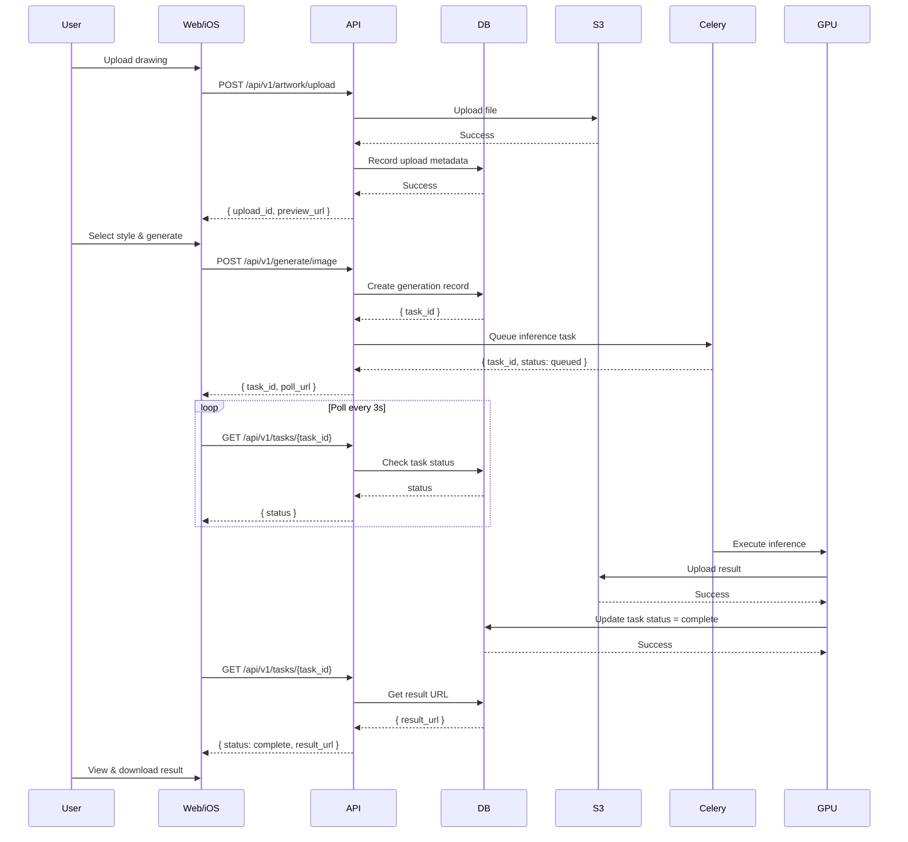
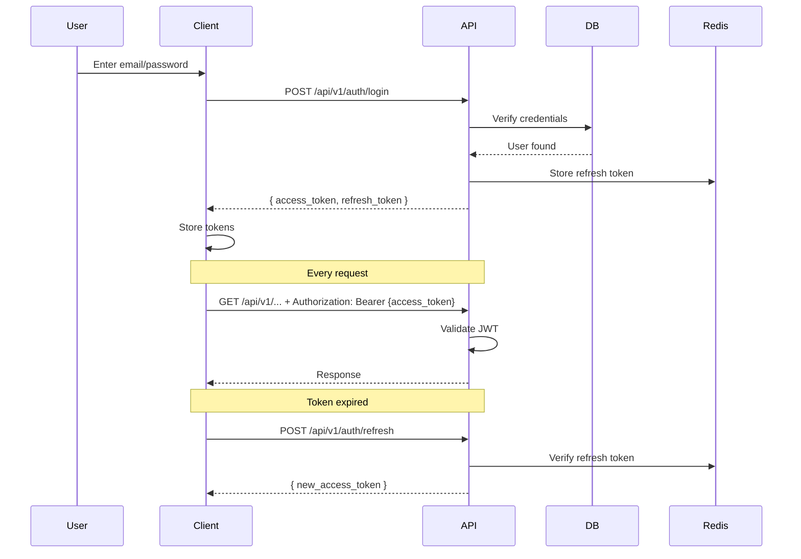

# Scribbly System Architecture Document

> **Project:** Scribbly — Multi-Platform AI Creative Tool for Kids  
> **Version:** 1.0.0  
> **Date:** 2026-03-29  
> **Status:** Draft — Pending Team Lead Approval

---

## 1. Executive Summary

Scribbly is a multi-platform AI-powered creative tool that transforms children's drawings into stylized artwork using Stable Diffusion, ControlNet, and LoRA models. The system comprises a React web frontend, SwiftUI iOS app, FastAPI backend, GPU-accelerated AI inference engine, and cloud storage.

---

## 2. System Context (C4 Level 1)



---

## 3. Container Diagram (C4 Level 2)



---

## 4. Component Diagrams

### 4.1 API Backend Components



### 4.2 AI Inference Pipeline Components



---

## 5. Data Flow Diagrams

### 5.1 Image Generation Flow



### 5.2 Authentication Flow



---

## 6. API Specification

### 6.1 API Versioning Strategy

- **Base URL:** `https://api.scribbly.app/api/v1/`
- **Versioning:** URL path (`/api/v1/`)
- **Deprecation:** 6-month notice via headers and docs

### 6.2 Endpoints Overview

| Method | Endpoint | Description |
|--------|----------|-------------|
| POST | `/auth/register` | Register new user |
| POST | `/auth/login` | Login, get tokens |
| POST | `/auth/refresh` | Refresh access token |
| POST | `/auth/logout` | Invalidate refresh token |
| POST | `/artwork/upload` | Upload drawing |
| POST | `/generate/image` | Generate styled image |
| POST | `/generate/animation` | Generate animation |
| GET | `/tasks/{task_id}` | Get task status |
| GET | `/gallery` | List user generations |
| GET | `/users/me/usage` | Get usage stats |
| GET | `/styles` | List available styles |

### 6.3 Request/Response Formats

```json
// POST /api/v1/generate/image
Request:
{
  "upload_id": "uuid",
  "style_id": "pixar_3d",
  "custom_prompt": "optional override"
}

Response (immediate):
{
  "task_id": "uuid",
  "status": "queued",
  "poll_url": "/api/v1/tasks/{task_id}"
}

Response (GET /tasks/{task_id}):
{
  "task_id": "uuid",
  "status": "complete",
  "result_url": "https://...",
  "created_at": "2026-03-29T10:00:00Z",
  "completed_at": "2026-03-29T10:00:45Z"
}
```

---

## 7. Infrastructure

### 7.1 Environment Tiers

| Tier | Purpose | URL | Database |
|------|---------|-----|----------|
| `local` | Development | localhost:3000 | SQLite |
| `staging` | Pre-production | staging.scribbly.app | PostgreSQL (staging) |
| `production` | Live | api.scribbly.app | PostgreSQL (production) |

### 7.2 Service Deployment

| Service | Platform | Instance Type | GPU |
|---------|----------|---------------|-----|
| FastAPI Backend | Fly.io | 2x CPU | No |
| AI Inference | AWS EC2 | g4dn.xlarge | NVIDIA T4 |
| PostgreSQL | Supabase/CloudSQL | Standard | N/A |
| Redis | Redis Cloud | 100MB | N/A |
| S3 Storage | AWS S3 / MinIO | Standard | N/A |
| Web Frontend | Vercel | Serverless | N/A |
| iOS App | App Store | N/A | N/A |

### 7.3 GPU Specifications

- **Model:** NVIDIA T4 (AWS g4dn.xlarge) or RTX 3090 (local development)
- **VRAM:** 16GB (T4) / 24GB (3090)
- **SDXL Requirements:** ~10GB VRAM
- **ControlNet Overhead:** ~2GB additional
- **Maximum Concurrent Inferences:** 1 per T4, 2 per 3090

---

## 8. Security

### 8.1 Authentication

- **Access Token:** JWT, 15-minute expiry, HS256
- **Refresh Token:** 7-day expiry, stored hashed in Redis
- **Password:** Bcrypt with cost factor 12

### 8.2 Rate Limits

| Endpoint | Limit |
|----------|-------|
| `/auth/login` | 5 requests/minute per IP |
| `/generate/*` | 10 requests/day (free tier) |
| All other | 100 requests/minute per IP |

### 8.3 Data Protection

- All S3 URLs signed with 1-hour expiry
- GPU inference server not publicly exposed (VPC only)
- Input validation on all endpoints
- Content safety filtering on prompts

---

## 9. Technical Stack Summary

| Layer | Technology |
|-------|-------------|
| Web Frontend | React 18, TypeScript, Vite, TailwindCSS |
| iOS App | Swift 5.9, SwiftUI |
| API Backend | FastAPI, Python 3.11, SQLAlchemy (async) |
| Database | PostgreSQL 16 |
| Cache/Queue | Redis 7 |
| Storage | S3 / MinIO |
| AI Framework | PyTorch 2.1, Diffusers, ControlNet |
| Task Queue | Celery + Redis |
| CI/CD | GitHub Actions |
| Deployment | Fly.io, Vercel, AWS |

---

## 10. Approval

| Role | Name | Status | Date |
|------|------|--------|------|
| Tech Lead / Architect | | Pending | |
| Backend Lead | | Pending | |
| Frontend Lead | | Pending | |
| iOS Lead | | Pending | |
| AI Engineer | | Pending | |

---

*Document Version: 1.0.0*  
*Last Updated: 2026-03-29*
